🔵 AWS Custom DHCP Option Set Lab

🔵 Objective

This assignment demonstrates how to configure a custom DHCP Option Set in AWS VPC and verify its behavior on a Linux EC2 instance.

### 🔹 Core Capabilities Demonstrated
. Custom DHCP configuration in AWS
. VPC networking fundamentals
. DNS and domain configuration
. Linux network verification
. Cloud infrastructure validation

### 🔹 AWS Services Used
. Amazon VPC
. Amazon EC2
. DHCP Option Sets

### 🔹 Assignment 

🔹 Phase 1: Create DHCP Option Set

🔹 Phase 2: Associate with VPC

🔹 Phase 3: Launch EC2 Instance

🔹 Phase 4: Verify Configuration

🔹 Phase 5: Troubleshooting & Renewal

### 🔹 Architecture Flow

User → AWS VPC → DHCP Option Set → EC2 Instance → Linux Network Config

### 🔹 Project Folder Structure

aws-custom-dhcp-option-set-lab/
│
├── README.md
├── screenshots/
│   ├── step1-dhcp-creation.png
│   ├── step2-vpc-association.png
│   ├── step3-ec2-launch.png
│   ├── step4-ssh-login.png
│   ├── step5-dns-check.png
│   ├── step6-domain-check.png
│   └── step7-dhcp-renew.png
└── notes/
    └── commands.txt

### 🔹 Implementation Steps

🔵 Phase 1: Create Custom DHCP Option Set

1. Go to VPC Dashboard
2. Click DHCP option sets
3. Click Create DHCP option set
4. Fill details:
. Name: custom-dhcp-lab
. Domain name: lab.internal
. DNS servers: 8.8.8.8, 8.8.4.4

Create DHCP option set:
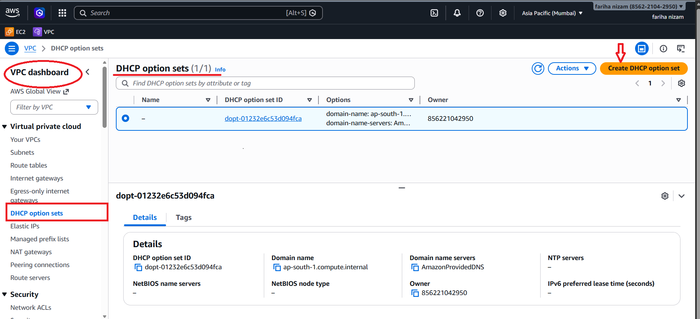

Fill details:
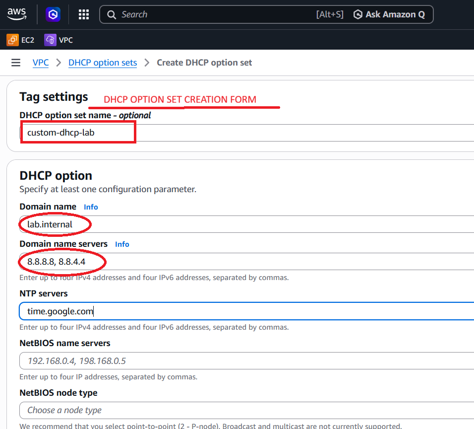

5. Click Create

🔵 Phase 2: Associate DHCP Option Set with VPC

1. Go to Your VPCs
2. Select Default VPC
3. Click Actions → Edit DHCP option set
4. Choose custom-dhcp-lab

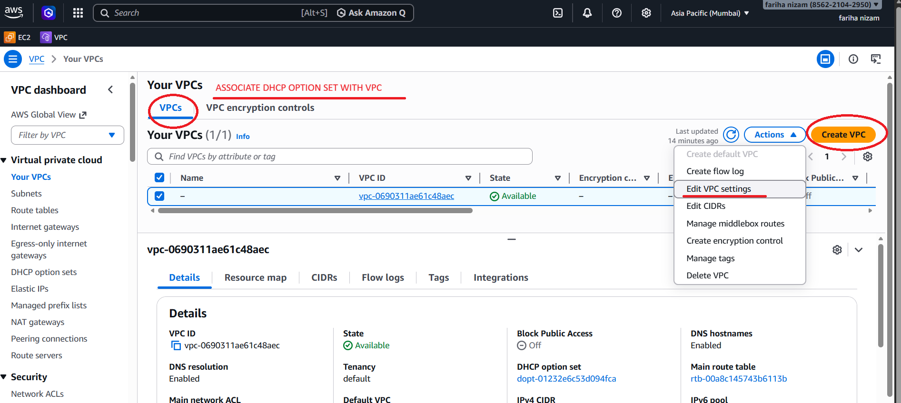

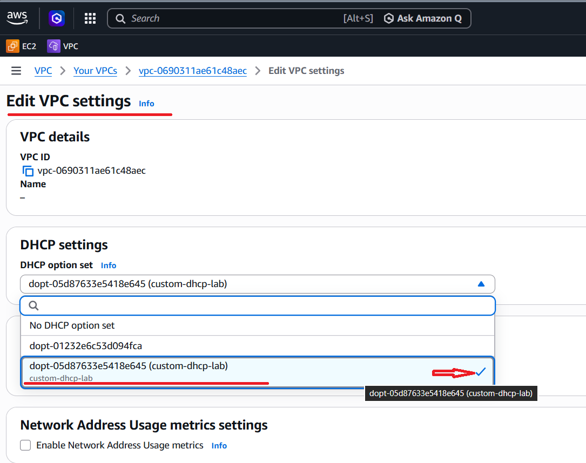

🔴 Important Rule

👉 EC2 must be launched in the SAME VPC where DHCP option set is attached

🔹 Before Going EC2

✔️ YES — select Default VPC when launching EC2

🔵 Why This Matters

DHCP settings are applied per VPC, not per instance.

👉 That means:

EC2 will only get custom DNS/domain
IF it is launched inside that VPC

🔵 Phase 3: Launch Linux EC2 Instance

1. Go to EC2 → Launch Instance
2. Choose:
     . AMI: Amazon Linux 2
     . Instance type: t2.micro
3. Select your VPC
4. Enable auto-assign public IP

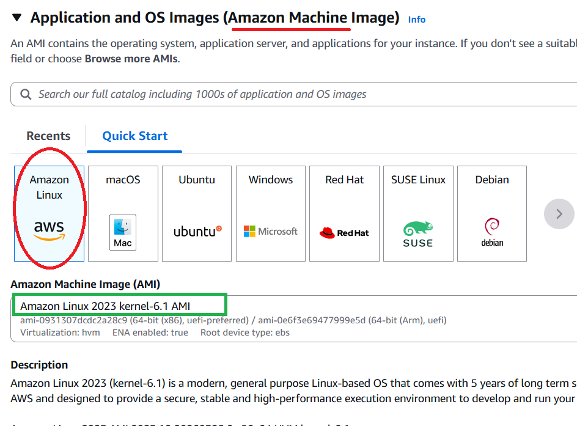

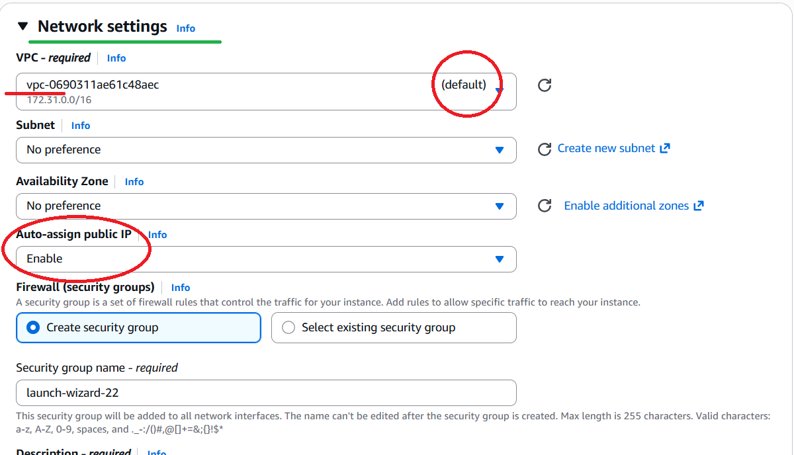

👉 “The default VPC and auto-assigned public IP were automatically selected by AWS during instance configuration.”

5. Launch instance

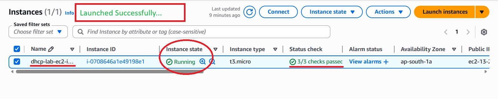

👉 Linux instance successfully running with assigned public IP”

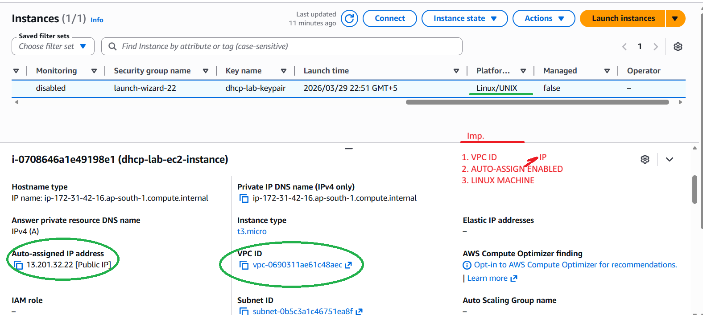

🔵 Phase 4: Connect to Instance

ssh -i your-key.pem ec2-user@your-public-ip

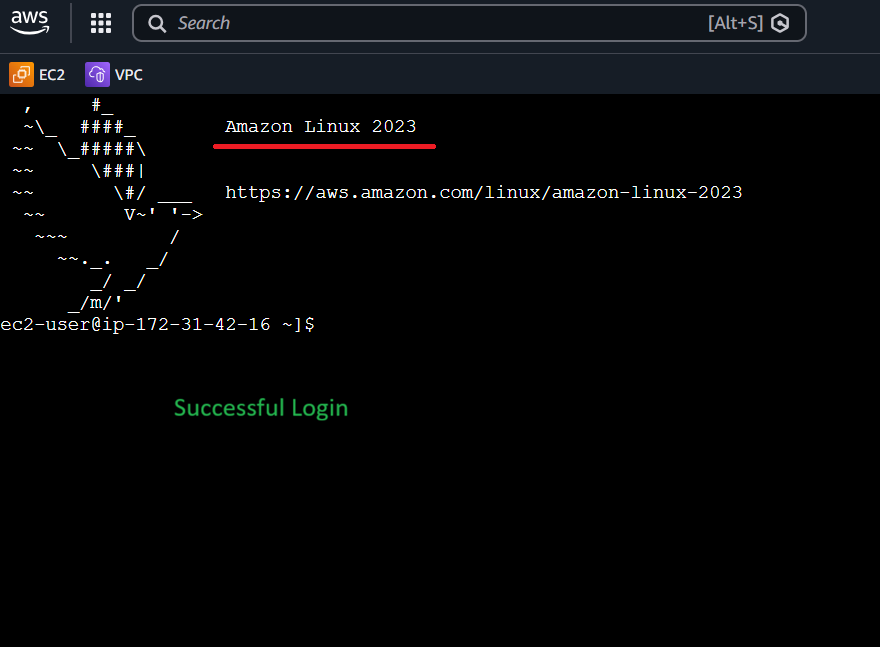

👉 “The EC2 connect interface confirms the default username (ec2-user) derived from the Amazon Linux AMI.”

🔵 Phase 5: Verify DHCP Settings

Run:

cat /etc/resolv.conf

Expected:

DNS should show 8.8.8.8

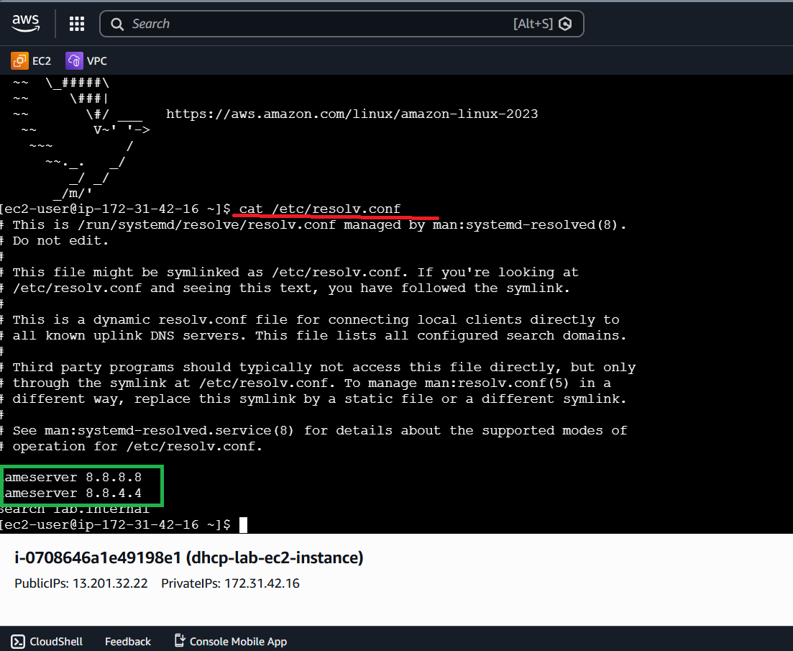

🔹 Check domain:

hostname -f

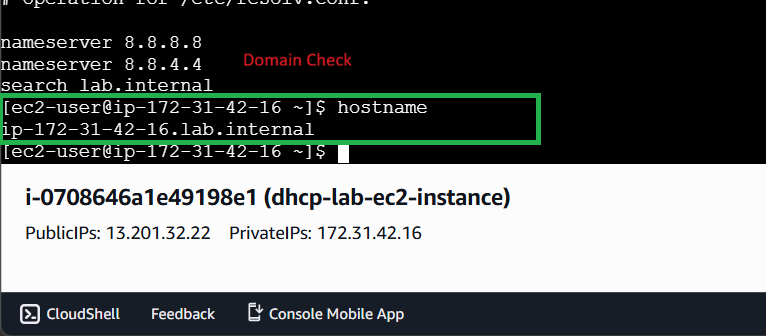

🔵 Phase 6: Renew DHCP Lease (if needed)

🔹 Check Detailed Network Info

sudo dhclient -v

🗣️ “Hey! Request new DHCP configuration”

✔️ Fast
✔️ No downtime
✔️ Best method

🔵 Why sudo dhclient or Stop/Start is Needed

👉 Problem is NOT with your commands
👉 Problem is HOW AWS applies DHCP changes

🔴 The Real Reason

When you:

✔️ Created DHCP Option Set
✔️ Associated it with VPC

👉 AWS does NOT immediately update running instances

🔥 Important Rule

👉 DHCP settings are applied ONLY when instance requests new IP config

🔵 What Happens Internally

Your EC2 already had:

. Old DHCP lease (default AWS DNS)
. Old network configuration

👉 So it keeps using old settings ❌

🔵 Solution: Stop & Start (Hard Refresh)

👉 When you:

. Stop instance

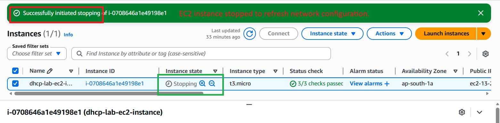

✅ Description:

“The EC2 instance was stopped to simulate a network reset and ensure that updated DHCP configuration settings could be applied upon restart.”

. Start again

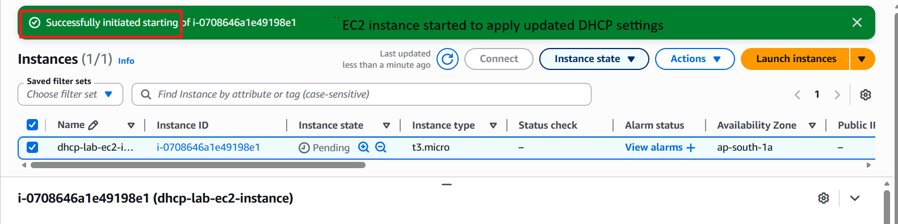

✅ Description:

“The EC2 instance was started again to allow it to obtain updated DHCP settings, including the custom domain name and DNS servers from the associated DHCP option set.”

⚠️ Remember

✔️ New DHCP request automatically happens
✔️ Fresh network config applied

🔴 Why NOT just Reboot?

👉 Reboot ≠ DHCP refresh ❌
👉 It may keep old lease

🔵 What likely happened in this case

1. Launched EC2
2. THEN applied DHCP option set

➡️ So instance still using old config

🔥 TL;DR

👉 AWS doesn’t auto-update running instances
👉 You must refresh DHCP:

✔️ sudo dhclient (best)
✔️ OR Stop/Start

⚠️ Remember

👉 No issue — just AWS behavior
👉 You refresh DHCP because instance had old network config

✅ must reconnect after stopping and starting the instance

👉 “Amazon Linux 2023 does not include dhclient by default. Therefore, DHCP configuration was refreshed by restarting the instance, and verification was performed using resolv.conf.”

🔵 Step 7: Renew DHCP

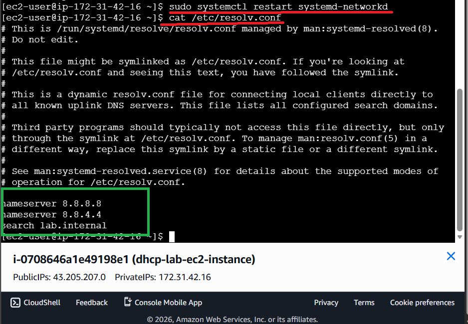

🔵 What This Confirms

👉 Your lab is 100% correct and complete ✅

👉 ✔️ Your custom domain name is applied
👉 ✔️ DNS applied
👉 ✔️ DHCP FULLY WORKING 💯

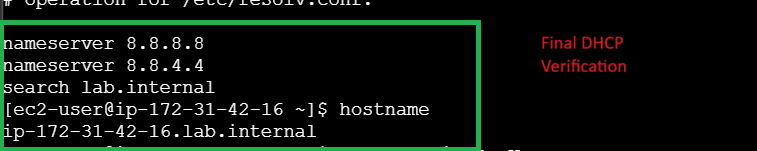

🔵 Lab Status

“The DHCP configuration was successfully verified. The EC2 instance received the custom domain name (lab.internal) and DNS servers (8.8.8.8, 8.8.4.4), confirming that the custom DHCP option set is functioning correctly.”

### 🔹 Visual Diagram    

        +---------------------+
        |   DHCP Option Set   |
        | DNS | Domain | NTP  |
        +----------+----------+
                   |
                   v
        +---------------------+
        |        VPC          |
        +----------+----------+
                   |
                   v
        +---------------------+
        |    EC2 Instance     |
        |  Linux Networking   |
        +---------------------+

🔹 How It Works
. AWS assigns network settings via DHCP
. DHCP Option Set overrides default DNS/domain
. EC2 instance receives configuration at boot
. Linux system applies settings automatically        

### 🔹 Updated Architecture (After Customization)

🔹 Before:

. Default AWS DNS

🔹 After:

. Custom DNS (Google)
. Custom domain (lab.internal)

            +------------------------------+
            |   DHCP Option Set (Custom)   |
            |------------------------------|
            | DNS: 8.8.8.8, 8.8.4.4        |
            | Domain: lab.internal         |
            | NTP: time.google.com         |
            +--------------+---------------+
                           |
                           v
                +----------------------+
                |         VPC          |
                +----------+-----------+
                           |
                           v
                +----------------------+
                |     EC2 Instance     |
                |----------------------|
                | /etc/resolv.conf     |
                | DNS → 8.8.8.8        |
                | Domain → lab.internal|
                +----------------------+

🔹 Explanation:

DHCP Option Set overrides default behavior
EC2 instances now receive:

✅ Custom DNS → 8.8.8.8, 8.8.4.4
✅ Custom Domain → lab.internal
✅ Custom NTP → time.google.com

🔹 Short Explanation
. Before customization, AWS assigns default DNS settings automatically
. After applying a custom DHCP Option Set, all EC2 instances:
. Use Google DNS instead of AWS DNS
. Resolve hostnames using custom domain (lab.internal)
. Sync time using custom NTP server

🔵 Before vs After

🔹 Before (Default)
DNS: AmazonProvidedDNS
Domain: ec2.internal

🔹 After (Custom)
DNS: 8.8.8.8
Domain: lab.internal

👉 “Default AWS DHCP option set was analyzed before applying custom configuration to understand baseline behavior.”

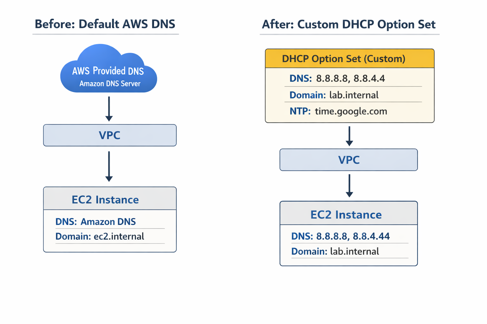

### 🔹 Real-World Use Case
. Enterprise internal DNS integration
. Hybrid cloud (on-prem + AWS)
. Centralized time synchronization
. Corporate domain environments

### 🔹 Security Reminder
. Avoid public DNS in sensitive environments
. Use private DNS for internal workloads
. Restrict EC2 SSH access (security groups)

### 🔹 Common Mistakes to Avoid
. Not associating DHCP set with VPC
. Expecting changes without instance restart
. Incorrect DNS IP format
. Forgetting to renew DHCP

### 🔹 TL;DR
. Create DHCP Option Set
. Attach to VPC
. Launch EC2
. Verify DNS/domain

### 🔹 Things to Remember
. One DHCP option set per VPC
. Changes are not instant
. Requires reboot or lease renewal

### 🔹 Conclusion

This lab provides practical exposure to AWS networking and demonstrates how DHCP customization impacts EC2 instances in real-world environments.

### 🔹 Post Lab Cleanup

Delete all resources to avoid charges.

### 🔹 Safe Deletion Order (IMPORTANT)
. Terminate EC2 instance
. Disassociate DHCP option set
. Delete DHCP option set
. Delete VPC (if created for lab)